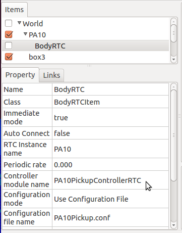
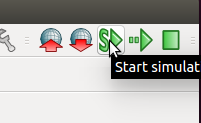

=========
 Connect
=========

This tutorial explains how to connect to external system in Choreonoid.

Load sample project
===================

Select "File" -> "Open Project" menu item and open "OpenRTM-PA10Pickup.cnoid" under "share/project" folder.

Configuration for your own project
==================================

If you want to edit motion sequence of your own robot model, apply following configuration.

From main menu:

* Create World item (select "File" -> "New..." -> "World").
* Load model item (select "File" -> "Open..." -> "OpenHRP Model File").
* Create BodyRTC item (select "File" -> "New..." -> "BodyRTC").

If you require physics simulation, add following additional items:

* Load floor model item (select "File" -> "Open..." -> "OpenHRP Model File").
* Create AISTSimulator item (select "File" -> "New..." -> "AISTSimulator").

In item panel:

Drag and drop the items to following order (model and simulator item must belong to the world item and BodyRTC item must belong to model item).

.. image:: rtm-config.png

Click BodyRTC item in the item panel and edit the property as:

* Controller module name: PA10PickupControllerRTC
* Configuration mode: Use Configuration File
* Configuration file name: PA10Pickup.conf

Create configuration file named "PA10Pickup.conf" with following content:

.. code-block:: ini
   :linenos:

   in-port = u_in:JOINT_TORQUE
   out-port = u_out:HAND_R,HAND_L:JOINT_TORQUE
   out-port = q:JOINT_VALUE
   connection = u_out:u_in
   connection = u_in:u_out
   connection = q:q

Above example create instance of PA10PickupControllerRTC and connect each ports to the robot model.

You can also use the components comes from hrpsys-base or create the component of your own (see :doc:`../basics/connect`).

Run the simulation
==================

Click "start simulation" button.

