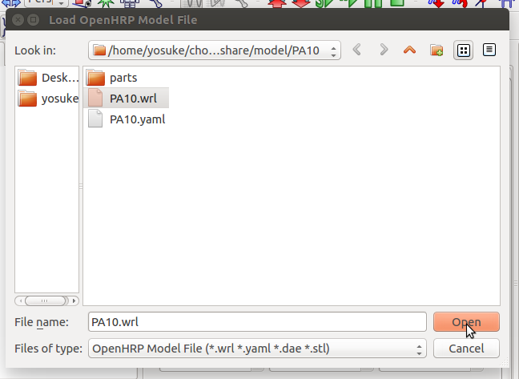
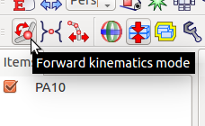
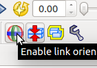
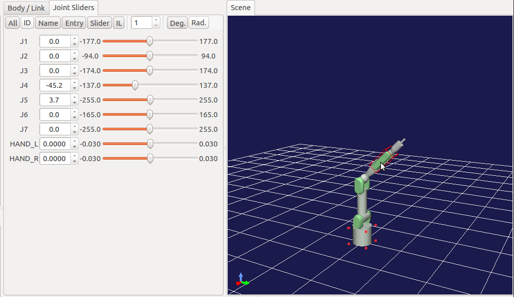
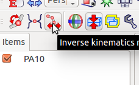
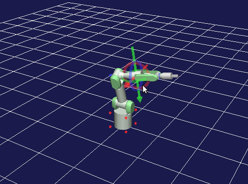

=======================================================
 Controlling robot with forward and inverse kinematics
=======================================================

One of the main feature of choreonoid is it can control and create a motion of the robot using built in inverse kinematics calculation algorithm.
In this tutorial, we will learn how to use the kinematics control features.

Loading the robot model
=======================

Select "File" -> "Open..." -> "OpenHRP Model File" menu item.

.. image:: open-model-file.png

Select and open "(source folder)/share/model/PA10.wrl" file.

Select and check "PA10" item from the items panel and the robot will be appeared in the scene panel.

.. image:: check-pa10.png

Control the robot by forward kinematics
=======================================

First, press the "Forward Kinematics Mode" button.

Also, press "Enable link orientation editing" button. This will enable you to control the joint of the robot directly under the scene panel.

Right click on the scene panel and click "Edit mode".

You can control each joints of the robot by using the "Joint Sliders" panel or by clicking the joints and links of the robot directly on the "Scene" panel.

Control the robot by inverse kinematics
=======================================

To use inverse kinematics based control, press the "Inverse Kinematics Mode" button.

Also, press "Enable link orientation editing" button. This will enable you to control the joint of the robot directly under the scene panel.

Right click on the scene panel and click "Edit mode".

You can control the robot by clicking the joints and links of the robot directly on the "Scene" panel.

