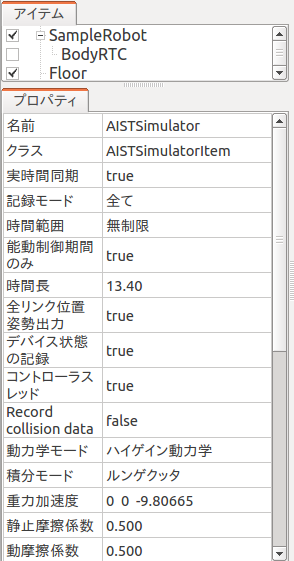
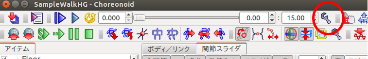
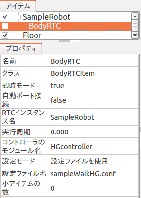
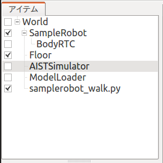
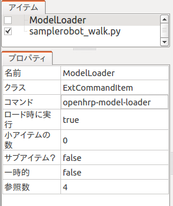
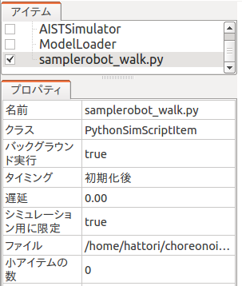

=================================
 hrpsys-simulatorからchoronoidへ
=================================

ここでは、hrpsys-simulator用のプロジェクトをchoreonoid用に変換する方法を説明します。
hrpsys-simulatorのサンプルは、下記から入手し、動作確認できるサンプルを使用しました。

http://wiki.ros.org/indigo/Installation/Ubuntu
からROSをインストール。

.. code-block:: ini

   sudo apt-get install ros-hydro-hrpsys-ros-bridge

   rtmlaunch hrpsys samplerobot.launch
   rosrun hrpsys samplerobot_walk.py 
   １を選択

準備
======

コントローラRTコンポーネントのファイル(HGcontroller.so)を（choreonoidのインストール先)/lib/choreonoid-1.5/rtcの中に置きます。
Pythonスクリプト(samplerobot_walk.py)は、（choreonoidのインストール先)/lib/choreonoid-1.5/pythonに置きます。

プロジェクトの作成
==================

シミュレーションアイテム
---------------------------

choreonoidを起動し、アイテムを追加して行きます。ここでは、hrpsys-simulator用のプロジェクトと対応付けて解説します。

.. code-block:: xml
   :linenos:
   
   <item class="com.generalrobotix.ui.item.GrxSimulationItem" name="simulationItem">
   　　　<property name="integrate" value="true"/>
   　　　<property name="timeStep" value="0.002"/>
   　　　<property name="totalTime" value="2000000.0"/>
   　　　<property name="method" value="EULER"/>
  　</item>

この設定は、シミュレーションアイテムに相当します。前の章の手順に従って、Worldアイテム、AISTSimulatorアイテムを作成します。

AISTSimulatorアイテムは以下の用に設定します：

* 実時間同期:true
* 時間範囲：無制限
* 動力学モード：順動力学、ハイゲイン動力学を選択
* 積分モード：オイラー、ルンゲクッタを選択

シミュレーションの刻み時間は、次のようにして設定します。
図のタイムバーの設定ボタンを押すと、ダイアログが開きます。

.. image:: timebar-conf.png

内部フレームレートを変更します。内部フレームレートが500のとき、シミュレーションは1/500(=0.002)秒間隔で実行されます。

モデルアイテムとBodyRTCアイテム
---------------------------------------

.. code-block:: xml
   :linenos:
   
   <item class="com.generalrobotix.ui.item.GrxModelItem" name="sample1" url="/opt/ros/indigo/share/OpenHRP-3.1/sample/model/sample1.wrl">
      <property name="rtcName" value="SampleRobot(Robot)0"/>
      <property name="inport" value="qRef:JOINT_VALUE"/>
      <property name="outport" value="q:JOINT_VALUE"/>
      <property name="WAIST.translation" value="0  0  0.7235"/>
      <property name="controller" value="SampleRobot"/>
         ......
   </item>  
   <item class="com.generalrobotix.ui.item.GrxRTSItem" name="SampleRobot" select="true">
      <property name="SampleRobot(Robot)0.period" value="0.002"/>
      <property name="HGcontroller0.period" value="0.002"/>
      <property name="HGcontroller0.factory" value="HGcontroller"/>
      <property name="connection" value="HGcontroller0.qOut:SampleRobot(Robot)0.qRef"/>
      <property name="connection" value="HGcontroller0.dqOut:SampleRobot(Robot)0.dqRef"/>
      <property name="connection" value="HGcontroller0.ddqOut:SampleRobot(Robot)0.ddqRef"/>
   </item>

これらの設定は、Modelアイテム、BodyRTCアイテムに相当します。前の章の手順に従って、モデルファイルをロードし、初期姿勢などを設定してください。

BodyRTCアイテムは以下のように設定します：

* 自動ポート接続： false
* RTCインスタンス名： SampleRobot
* コントローラのモジュール名： HGcontroller
* 設定モード: 設定ファイルを使用
* 設定ファイル名： sampleWalkHG.conf

inport,outport,connectionの設定は、設定ファイル名で指定したファイルに記述します。これは後で説明します。
これらのコンポーネントはシミュレーションの実行周期に同期して実行されます。

他に必要なアイテム
----------------------

.. code-block:: xml
   :linenos:
   
   <item class="com.generalrobotix.ui.item.GrxModelItem" name="longfloor" url="/opt/ros/indigo/share/OpenHRP-3.1/sample/model/longfloor.wrl">
   　　　<property name="WAIST.translation" value="0  0  -0.1"/>
   　　　<property name="WAIST.rotation" value="1 0 0 0"/>
  　</item>
  　<item class="com.generalrobotix.ui.item.GrxCollisionPairItem" name="CP#longfloor_#sample1_">
      <property name="springConstant" value="0 0 0 0 0 0"/>
      <property name="slidingFriction" value="0.5"/>
         ....

床のモデルアイテムも作成してください。　干渉ペアの設定はchoreonoidではありません。基本設定では、全てのモデルが干渉チェックの対象になっています。対象から外したい場合はモデルアイテムの干渉検出プロパティをfalseに設定します。また、モデルの自己干渉を行わないようにする場合は、自己干渉検出をfalseに設定します。摩擦係数の設定は、Simulationアイテムで行います。

更に、メインメニューからpythonスクリプト用に以下のアイテムを作成します。

* ModelLoaderアイテムを作成（ “ファイル” -> “新規” -> “外部コマンド”を選択。名前欄にModelLoaderと入力して、生成）。
* pythonスクリプトアイテムをロード（ "ファイル" -> "読み込み" -> "シミュレーション用Pythonスクリプト"を選択。samplerobot_walk.pyファイルを選択）。

modelファイルとpythonスクリプトファイルにはチェックを入れて、図のような構成にします。

ModelLoaderアイテムは以下のように設定します：

* コマンド: openhrp-model-loader

Pythonアイテムは以下のように設定します：

* バックグラウンド実行: true

作成したプロジェクトは、名前を付けてファイルに保存しておきます。

BodyRTCの設定ファイルの作成
================================

BodyRTCアイテムで説明した設定ファイルsampleWalkHG.confを（choreonoidのインストール先)/lib/choreonoid-1.5/rtcに作成します。
hrpsys-simulator用のプロジェクトに記述してあった、inport,outport,connectionの設定を以下の様に記述します。

.. code-block:: ini
   :linenos:

   in-port = qRef:JOINT_VALUE
   in-port = dqRef:JOINT_VELOCITY
   in-port = ddqRef:JOINT_ACCELERATION
   out-port = q:JOINT_VALUE
   out-port = tau:JOINT_TORQUE
   out-port = lfsensor:lfsensor:FORCE_SENSOR
   out-port = rfsensor:rfsensor:FORCE_SENSOR
   out-port = lhsensor:lhsensor:FORCE_SENSOR
   out-port = rhsensor:rhsensor:FORCE_SENSOR
   out-port = gyrometer:gyrometer:RATE_GYRO_SENSOR
   out-port = gsensor:gsensor:ACCELERATION_SENSOR
   out-port = WAIST:WAIST:ABS_TRANSFORM
   connection = qRef:HGcontroller0:qOut
   connection = dqRef:HGcontroller0:dqOut
   connection = ddqRef:HGcontroller0:ddqOut
    

RTコンポーネントの設定ファイルの作成
=======================================

rtc.conf ファイルをカレントフォルダに作成します。各RTコンポーネントの設定ファイル(SampleRobot.500.conf)も、ここに置きます。

rtc.confには、以下の様に記述します。

.. code-block:: ini
   :linenos:

   corba.nameservers: 127.0.0.1
   naming.formats: %n.rtc
   logger.enable: YES
   logger.log_level: NORMAL
   logger.file_name: stdout
   manager.shutdown_onrtcs: NO
   manager.is_master: YES
   manager.modules.load_path: /usr/local/lib
   example.HGcontroller.config_file: SampleRobot.500.conf
   example.PDcontroller.config_file: SampleRobot.500.conf
   example.SequencePlayer.config_file: SampleRobot.500.conf
   example.StateHolder.config_file: SampleRobot.500.conf
   example.ForwardKinematics.config_file: SampleRobot.500.conf

example.HGcontroller.config_file: SampleRobot.500.conf　は、HGcontrollerの設定ファイルがSampleRobot.500.confであることを指定しています。

Pythonスクリプトの修正
===========================

hrpsys-simulatorで使用したPythonスクリプトは、一部修正が必要です。
例えば、　samplerobot_walk.pyの場合、下の様に黄色で示した５行目を修正、２５，２６行を追加します。

.. code-block:: python
   :linenos:
   :emphasize-lines: 5,25-26
   
   #!/usr/bin/env python

   try:
       from hrpsys_config import *
       import hrpsys.OpenHRP
   except:
       print "import without hrpsys"
       import rtm
       from rtm import *
       from OpenHRP import *
       import waitInput
       from waitInput import *
       import socket
       import time

   def getRTCList ():
       return [
           ['seq', "SequencePlayer"],
           ['sh', "StateHolder"],
           ['fk', "ForwardKinematics"]
           ]

   def init ():
       global hcf
       sys.argv = []
       rtm.nsport=2809
       hcf = HrpsysConfigurator()
       hcf.getRTCList = getRTCList
       hcf.init ("SampleRobot")

   def loadPattern(basename, tm=1.0):
       hcf.loadPattern(basename, tm)
       hcf.waitInterpolation()

   def demo():
       init()
       loadPattern("/opt/ros/indigo/share/OpenHRP-3.1/sample/controller/SampleController/etc/Sample")

   if __name__ == '__main__':
       demo()

シミュレーションの実行
============================

カレントディレクトリから、 choreonoidを起動し、保存したプロジェクトファイルを読み込みます。
シミュレーション実行ボタンを押します。
 
 
