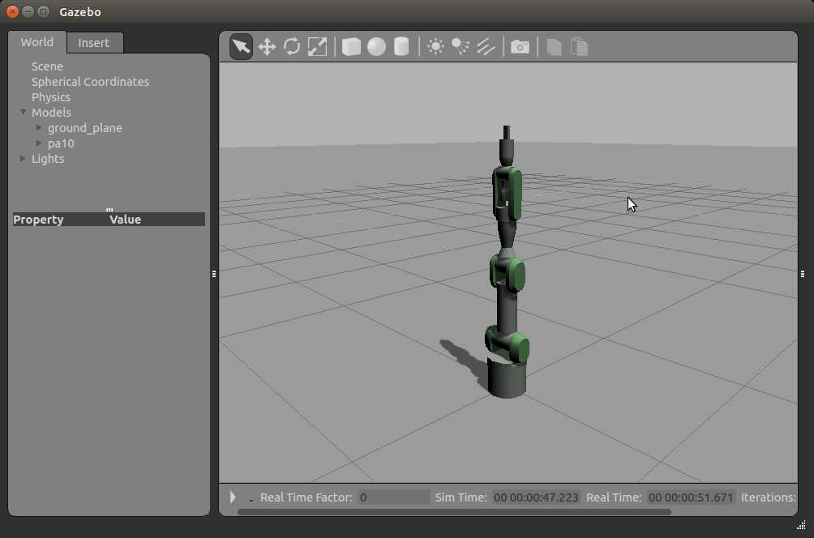

=========================
Run your first simulation
=========================

hrpsys-gazebo-simulator command
===============================

The hrpsys-gazebo-simulator command loads and runs a simulation. It is called like follows::
  
  $ hrpsys-gazebo-simulator [project file] [gazebo world file] [options]

Where **project file** is the xml file which defines system configuration (explained later).
**gazebo world file** is the xml file which defines simulation world.

The hrpsys-gazebo-simulator command has following options:

.. program:: hrpsys-gazebo-simulator

.. option:: -nodisplay

   Headless mode.

.. option:: -realtime
   
   Synchronize to real world time.

.. option:: -endless

   Endless mode.

.. option:: -h --help

   Show help message.

Interact with the simulation window
===================================

Simulation window is just as same as the gazebo.

To translate the simulation world **left click and drag**.

You can rotate the simulation world by **shift key + left click and drag**.

